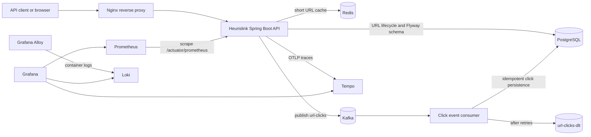

# Heurislink Architecture

## Context

Heurislink separates the synchronous redirect path from click analytics. A redirect only needs the URL lookup and event publication to complete; analytics persistence is handled asynchronously so database writes do not add latency to the user-facing redirect.

## Component diagram

## Request flows

### Create

1. The client sends `POST /urls` through Nginx.
2. The API resolves the client IP and increments a Redis rate-limit counter.
3. The service generates a unique ten-character code and stores the URL in PostgreSQL.
4. The API returns `201 Created` with the code and complete short URL.

### Redirect

1. The API reads the code from Redis when cached, otherwise from PostgreSQL.
2. Inactive and expired links are rejected before redirecting.
3. The API publishes a `UrlClickEvent` to Kafka and returns `302 Found` with the original URL in the `Location` header.
4. The Kafka consumer persists the click asynchronously. Event IDs are unique, so redelivery does not double-count clicks.

### Failure handling

- Kafka consumer failures are retried three times with a one-second fixed backoff.
- Messages that still fail are published to `url-clicks-dlt` for inspection/recovery.
- PostgreSQL schema changes are applied by Flyway at startup.
- Kubernetes readiness/liveness probes use Spring Boot health groups.
- The deployment uses rolling updates, a PodDisruptionBudget, and an HPA targeting 70% CPU utilization.

## Data ownership

| Store | Data | Access pattern |
| --- | --- | --- |
| PostgreSQL | `short_urls`, `url_clicks` | Source of truth and analytics queries |
| Redis | `shortUrls` cache and create rate-limit counters | Fast lookup and distributed request control |
| Kafka | `url-clicks` and `url-clicks-dlt` | Durable asynchronous click delivery |

## Security and operations

The API is stateless and uses no session authentication. CSRF is disabled because the service exposes a stateless API. Public actuator access is limited to health and Prometheus; all other actuator endpoints are denied. The container and Kubernetes pod run as a non-root user with dropped Linux capabilities and a read-only root filesystem.
